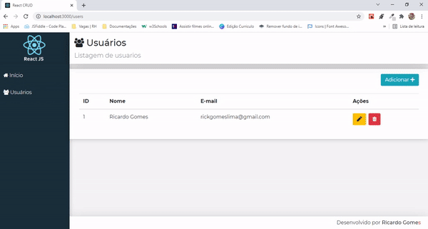

 
 

## Descrição
Projeto desenvolvido em ReactJS para por em prática os conhecimentos adquiridos durante os estudos do Chapter I e Chapter II da trilha de ReactJS do Bootcamp Ignite da Rocketseat, nele é possível listar, cadastrar, editar e excluir usuários.

 

## Desenvolvido utilizando as tecnologias:

* **TypeScript** (superset para a linguagem JavaScript)
* useState (hook que armazena dados que podem variar com o tempo, possibilitando renderizar a informação para o frontend web ou mobile)
* useEfect (hook utilizado para controlar a execução de uma função a partir da alteração de um determinado parâmetro)
* Styled-Components (biblioteca que permite escrever códigos CSS dentro do Javascript)
* Axios (biblioteca utilizada para interceptar requisições e respostas pra nossa API antes de chegar no back-end)
* React Modal (biblioteca que renderiza o conteúdo de seu filho sobre um componente backdrop e fornece muitos recursos relacionados a interação destes dois)
* Tostify (biblioteca para criar notificações personalizadas)
* bootstrap (framework web para aplicar responsividade)
* json-server (pacote npm que simula uma API, as chamdas fake API)
* font-awesome (conjunto de ferramentas de fontes e ícones com base em CSS e LESS)

 
 
 

## Apresentação
 

  <ul> <li> Pouco do Código e sua execução </li> </ul> 

 
  

  <ul> <li> Responsividade </li> </ul> 

  
  

 

  <ul> <li> Demonstrando o CRUD </li> </ul> 

  

